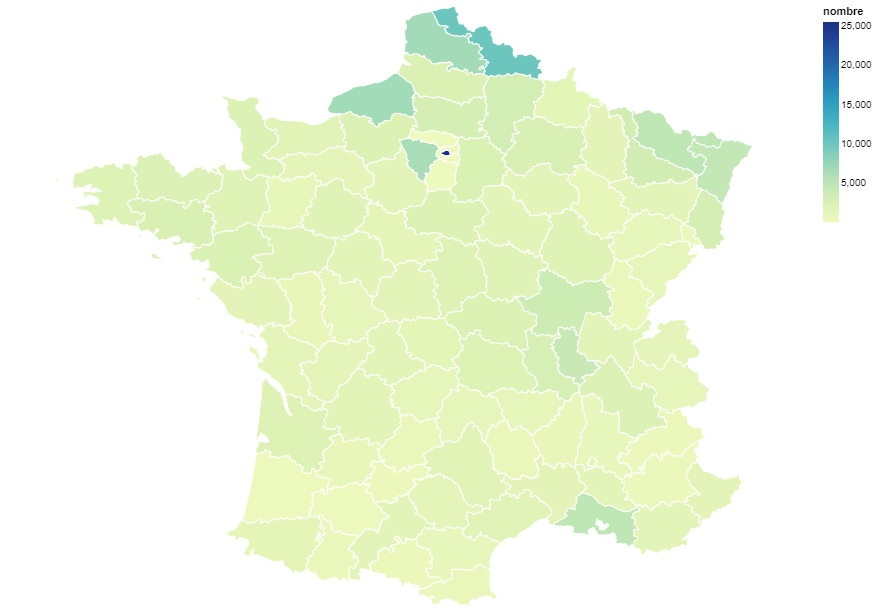
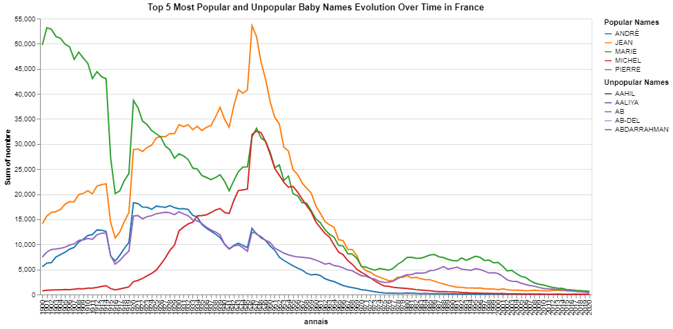
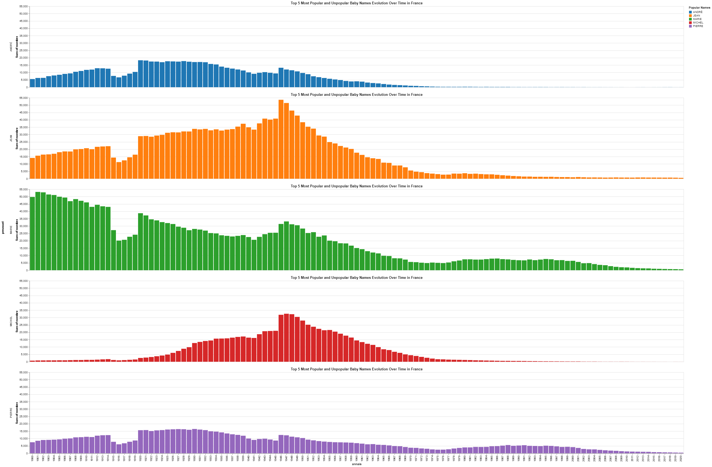

# IGR_Visualisation
Baby names project

## Introduction

This notebook demonstrates how to create choropleth maps using the Altair library. The example uses a large dataset of first names in France from 1900 to 2019, broken down by department.

## Contents

The notebook covers the following steps:
1. Importing the necessary libraries.
2. Read first name data from a CSV file.
3. Load geographic data for French departments using `geopandas`.
4. Merge first name data with geographic data.
5. Creation and visualization of choropleth maps to analyze the distribution of first names.

## Libraries used

The notebook uses the following libraries:
- `altair`: to create interactive visualizations.
- `pandas`: to manipulate tabular data.
- `geopandas`: for working with geographic data.

## Instructions

**Library import**
   python
   import altair as alt
   import pandas as pd
   import geopandas as gpd
   ```

**Reading first-name data**
   First name data is read from a CSV file with a `;` separator.

**Geographic data loading**
   Geographic data for French departments are loaded from a `geojson` file provided by [Grégoire David](https://gregoiredavid.fr).

**Data merging**
   First name data and geographic data are merged using a `right-merge` to ensure that the data structure remains a `geopandas` dataframe.

**Visualization**
   A choropleth map is created to show the distribution of a specific first name over a given period. For example, the distribution of the first name "Lucien" over the last 120 years in mainland France.

## References

- [INSEE](http://www.insee.fr/fr/methodes/nomenclatures/cog/telechargement.asp)
- [IGN](https://geoservices.ign.fr/adminexpress)
```

## Examples of visualizations
### Representation 1: Heatmap of France by Number of Names



#### Advantages:
- Provides a clear view of the distribution of names across different regions.
- Easy to see which regions have higher or lower counts due to the color gradient.
- Allows for quick comparison between regions.

#### Drawbacks:
- Does not provide detailed numerical data or trends over time.
- Color gradients might be hard to distinguish for some viewers, especially those with color vision deficiencies.
- Does not show changes over time, only a snapshot.

### Representation 2: Line Chart of Popular and Unpopular Baby Names Over Time



#### Advantages:
- Clearly shows how the popularity of names has changed over time.
- Easy to compare multiple names simultaneously.
- Provides detailed information on the number of names over time.

#### Drawbacks:
- Can be difficult to read with many lines and overlapping data points.
- With many names, the chart can become cluttered.
- Not easily scalable to show more names without becoming even more cluttered.

### Representation 3: Bar Charts for top 5 Names Over Time



#### Advantages:
- Easy to compare two names directly.
- Shows the distribution of names over time clearly.
- Less complex and easier to read than multi-line charts.

#### Drawbacks:
- Only shows two names, not suitable for comparing many names.
- Lacks geographic distribution details.
- Cannot easily show more names without creating separate charts.

## Additional Details

On the sheet containing three charts:
1. The first chart displays the most common first names on the map of France.
2. The second chart shows the evolution of the occurrence of first names over the years.
3. The last chart zooms in on the Île-de-France region to display the most common first names.


